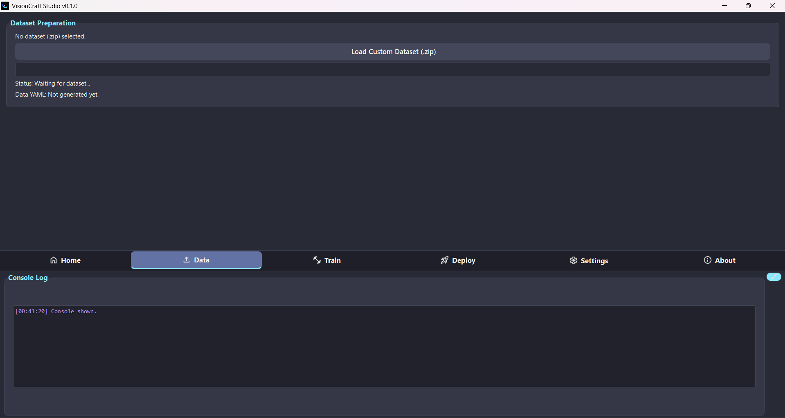

# VisionCraft Studio ✨

[](https://opensource.org/licenses/MIT)
[](https://www.python.org/downloads/)
[](https://riverbankcomputing.com/software/pyqt/)
[](https://ultralytics.com/)
[](https://github.com/memidhun/vcstudio) 
<!--
[](https://github.com/memidhun/vcstudio/issues)
[](https://github.com/memidhun/vcstudio/network/members) <!-- Replace with your username/repo -->
[](https://github.com/memidhun/vcstudio) <!-- Replace with your username/repo -->
<!-- Banner Image -->
<p align="center">
  
</p>
VisionCraft Studio is a user-friendly desktop application designed to simplify the process of creating, training, and deploying custom deep learning YOLO (You Only Look Once) object detection and segmentation models. With an intuitive Graphical User Interface (GUI), users can manage datasets, train models, perform real-time inference, and export models to various formats without writing extensive code.

## 🌟 Features

* **Intuitive GUI:** Easy-to-navigate interface built with PyQt5.
* **Dataset Management:**
    * Load custom datasets from `.zip` files (images and YOLO format labels).
    * Automatic splitting into training and validation sets.
    * Generation of `data.yaml` for YOLO training.
* **Model Training:**
    * Train YOLOv8 detection and segmentation models.
    * Select from various pre-trained YOLOv8 backbones (e.g., yolov8n, yolov8s, yolov8m).
    * Customize training parameters: epochs, image size, compute device (CPU/GPU).
    * Organized project runs for training outputs.
* **Model Deployment & Inference:**
    * Load custom trained `.pt` models or other compatible formats.
    * Real-time inference via webcam.
    * Inference on local video or image files.
    * Adjustable webcam resolution and confidence thresholds.
    * Display FPS and detected object counts.
* **Model Export:**
    * Convert trained PyTorch models to various formats including ONNX, TorchScript, CoreML, TensorFlow Lite, OpenVINO, and more.
* **Dependency Management:**
    * In-app installation/verification for the Ultralytics library.
    * Assisted installation for model-specific backends (e.g., ONNX Runtime, OpenVINO).
* **Customization:**
    * Switch between Light and Dark (Dracula) UI themes.
    * Configurable default compute device.
* **User-Friendly Output:**
    * Integrated console log for monitoring processes.
    * Clear status updates and progress bars.

## 🎬 Demo

<p align="center">
  
</p>

## 🌐 View Online!

Experience VisionCraft Studio's interface right in your browser! Visit the web demo to explore the UI and features:

[](https://memidhun.github.io/vcstudio/)

*Note: This is a static UI demo showcasing the application's interface. To work with actual datasets, train models, and perform real-time inference, please download and install the full desktop application.*

## 📸 Screenshots

<!-- Add a few screenshots of your application -->
<p align="center">
  <b>Main Interface (Home Page)</b><br>
  <br><br>
  <b>Data Preparation Page</b><br>
  <br><br>
  <b>Training Configuration Page</b><br>
  <br><br>
  <b>Deployment & Live Inference Page</b><br>
  <br><br>
  <b>Light Theme Example</b><br>
  
</p>

## 🛠️ Tech Stack

* **Python:** Core programming language.
* **PyQt5:** For the Graphical User Interface.
* **Ultralytics :** For object detection and segmentation model training and inference.
* **OpenCV (cv2):** For image and video processing.
* **PyTorch:** Underlying framework for YOLO.
* **YAML:** For configuration files.
* **NumPy:** For numerical operations.

## ⚙️ Prerequisites

* Python 3.7 or higher.
* `pip` (Python package installer).
* Git (for cloning the repository).

The application will guide you to install `ultralytics` and other necessary model backends if they are not found.

## 🚀 Installation & Setup

1.  **Clone the repository:**
    ```bash
    git clone https://github.com/memidhun/vcstudio.git
    cd vcstudio
    ```

2.  **Create and activate virtual environment:**

    **Using venv (Recommended):**
    
    *Windows:*
    ```bash
    # Create virtual environment
    python -m venv venv
    
    # Activate virtual environment
    venv\Scripts\activate
    
    # Verify activation (should show path to venv)
    where python
    ```

    *Linux/macOS:*
    ```bash
    # Create virtual environment
    python3 -m venv venv
    
    # Activate virtual environment
    source venv/bin/activate
    
    # Verify activation (should show path to venv)
    which python
    ```

    **Using Conda (Alternative):**
    ```bash
    # Create conda environment
    conda create -n vcstudio python=3.10
    
    # Activate conda environment
    conda activate vcstudio
    
    # Verify activation
    conda info --envs
    ```

3.  **Install required Python packages:**
    ```bash
    pip install -r requirements.txt
    ```

    <!-- **Required packages from `requirements.txt`:**
    ```
    certifi==2025.4.26
    charset-normalizer==3.4.2
    colorama==0.4.6
    coloredlogs==15.0.1
    contourpy==1.3.2
    cycler==0.12.1
    filelock==3.18.0
    flatbuffers==25.2.10
    fonttools==4.58.2
    fsspec==2025.5.1
    humanfriendly==10.0
    idna==3.10
    Jinja2==3.1.6
    kiwisolver==1.4.8
    MarkupSafe==3.0.2
    matplotlib==3.10.3
    mpmath==1.3.0
    networkx==3.5
    numpy==2.3.0
    onnx==1.18.0
    onnxruntime==1.22.0
    opencv-python==4.11.0.86
    packaging==25.0
    pandas==2.3.0
    pillow==11.2.1
    protobuf==6.31.1
    psutil==7.0.0
    py-cpuinfo==9.0.0
    pyparsing==3.2.3
    PyQt5==5.15.11
    PyQt5-Qt5==5.15.2
    PyQt5_sip==12.17.0
    pyreadline3==3.5.4
    python-dateutil==2.9.0.post0
    pytz==2025.2
    PyYAML==6.0.2
    requests==2.32.4
    scipy==1.15.3
    six==1.17.0
    sympy==1.14.0
    torch==2.7.1
    torchvision==0.22.1
    tqdm==4.67.1
    typing_extensions==4.14.0
    tzdata==2025.2
    ultralytics==8.3.153
    ultralytics-thop==2.0.14
    urllib3==2.4.0
    ``` -->

4.  **Dataset Preparation Methods**

    There are several ways to prepare your custom dataset for object detection:

    ### A. Using Label Studio (Recommended for Beginners)
    Label Studio is a powerful tool for data labeling and annotation. Follow these steps:

    **Installation:**
    
    *Windows:*
    ```bash
    # Using pip
    pip install label-studio
    
    # Using conda
    conda install -c conda-forge label-studio
    ```

    *Linux/macOS:*
    ```bash
    # Using pip
    pip3 install label-studio
    
    # Using conda
    conda install -c conda-forge label-studio
    ```

    **Basic Usage:**
    1. Start Label Studio:
       ```bash
       label-studio start
       ```
    2. Open your browser and go to `http://localhost:8080`
    3. Create a new project and required select type , for example : "Object Detection with Bounding Boxes"
    4. Import your images
    5. Label your images with bounding boxes
    6. Export your labels in YOLO format:
       - Go to Export
       - Select "YOLO" format
       - Download the exported files

    For more information about Label Studio, visit [labelstud.io](https://labelstud.io/)

    ### B. Using CVAT (Computer Vision Annotation Tool)
    CVAT is another powerful open-source tool for image annotation.

    **Installation:**
    ```bash
    # Using Docker (recommended)
    docker pull cvat/cvat
    docker run -d --name cvat -p 8080:8080 cvat/cvat
    ```

    Visit [cvat.org](https://www.cvat.ai/) for more details.

    ### C. Using Roboflow
    Roboflow provides a user-friendly web interface for dataset preparation.

    1. Visit [roboflow.com](https://roboflow.com)
    2. Create an account
    3. Create a new project
    4. Upload your images
    5. Label your data
    6. Export in YOLO format

    ### D. Manual Dataset Preparation
    You can also prepare your dataset manually:

    1. Organize your images in a directory
    2. Create corresponding label files (.txt) in YOLO format
    3. Create a classes.txt file with your class names
    4. Split your data into train/val sets

    **Dataset Structure for VisionCraft Studio:**
    After preparing your dataset using any of the above methods, organize your files as follows:
    ```
    my_dataset.zip
    ├── images/
    │   ├── train/
    │   │   ├── img1.jpg
    │   │   └── ...
    │   └── val/
    │       ├── img2.jpg
    │       └── ...
    ├── labels/
    │   ├── train/
    │   │   ├── img1.txt
    │   │   └── ...
    │   ├── val/
    │   │   ├── img2.txt
    │   │   └── ...
    │   └── (Or all labels directly here)
    │       ├── img1.txt
    │       ├── img2.txt
    │       └── ...
    └── classes.txt
    ```

    **YOLO Label Format:**
    Each label file (.txt) should contain one line per object in the format:
    ```
    <class_id> <x_center> <y_center> <width> <height>
    ```
    Where:
    - `class_id`: Index of the class (starting from 0)
    - `x_center, y_center`: Normalized center coordinates (0-1)
    - `width, height`: Normalized width and height (0-1)

5.  **Ensure you have icons:**
    The application looks for icons in an `icons/` directory (with subdirectories for `light`/`dark` themes). Make sure this directory and the necessary icons are present. The script `visioncraftstudio.py` includes a function `create_dummy_icons_if_needed()` which can serve as a temporary placeholder or guide for required icons.

6.  **Run the application:**
    ```bash
    python visioncraftstudio.py
    ```

## 📖 Usage

VisionCraft Studio is organized into several tabs for a streamlined workflow:

1.  **🏠 Home:** Welcome screen with an overview of the application.

2.  **📊 Data:**
    * Prepare your dataset using Label Studio (see installation steps above)
    * Click "Load Custom Dataset (.zip)" to select your prepared dataset
    * The application will automatically process and prepare the `data.yaml` file

3.  **🧠 Train:**
    * Select a base YOLOv8 model (e.g., `yolov8s.pt`)
    * Set training parameters like epochs, image size
    * Choose a project name for your training run
    * Click "Start Training". The trained model (`best.pt`) will be saved in `trained_models_gui/`
    * Optionally, auto-load the trained model into the Deploy tab

4.  **🚀 Deploy:**
    * Load a trained model (e.g., your custom `best.pt` or other compatible model files)
    * **Live Inference:**
        * Select an available webcam and resolution
        * Click "Start Webcam" to begin live detection/segmentation
    * **File Inference:**
        * Click "Load Video/Image File" to run inference on a local media file
    * **Model Conversion:**
        * Select an export format (e.g., ONNX, TFLite)
        * Click "Convert & Export Model". Exported models are saved in `exported_models_gui/`

5.  **⚙️ Settings:**
    * Install or verify the Ultralytics library
    * Select your preferred compute device (CPU or available CUDA GPUs)
    * Change the UI theme (Light/Dark)

6.  **ℹ️ About:** Information about VisionCraft Studio

### Expected Dataset Structure

Your dataset should be provided as a `.zip` file with one of the following structures:

#### Structure 1: Pre-split Dataset
```
my_dataset.zip
├── images/
│   ├── train/              # Optional, can be flat
│   │   ├── img1.jpg
│   │   ├── img2.png
│   │   └── ...
│   ├── val/               # Optional, can be flat
│   │   ├── img3.jpg
│   │   └── ...
│   └── (Or all images directly here if not pre-split)
│       ├── img1.jpg
│       ├── img2.png
│       └── ...
├── labels/
│   ├── train/             # Mirrors images structure if pre-split
│   │   ├── img1.txt
│   │   ├── img2.txt
│   │   └── ...
│   ├── val/              # Mirrors images structure if pre-split
│   │   ├── img3.txt
│   │   └── ...
│   └── (Or all labels directly here)
│       ├── img1.txt
│       ├── img2.txt
│       └── ...
└── classes.txt
```

#### Structure 2: Simple Dataset
```
my_dataset.zip
├── dataset_root_folder/    # Optional intermediate folder
│   ├── images/
│   │   ├── img1.jpg
│   │   └── ...
│   ├── labels/
│   │   ├── img1.txt
│   │   └── ...
│   └── classes.txt
└── (Or images/, labels/, classes.txt directly at the root of the zip)
```

**Note:**
- The `classes.txt` file should list one class name per line
- Label files (`.txt`) should be in YOLO format

### Project Structure

```
vcstudio/
├── visioncraftstudio.py      # Main application script
├── requirements.txt          # Python dependencies
├── README.md                # Documentation
├── icons/                   # UI icons directory
│   ├── light/              # Light theme icons
│   ├── dark/               # Dark theme icons
│   └── Demo/               # Demo screenshots
├── yolo_gui_workspace/     # Workspace for dataset processing
├── trained_models_gui/     # Directory for saved trained models
└── exported_models_gui/    # Directory for exported/converted models
```

## 🌊 Workflow

1.  **Prepare Data:** Use the "Data" tab to load and process your custom dataset.
2.  **Train Model:** Go to the "Train" tab, configure parameters, and train your YOLOv8 model.
3.  **Test & Deploy:**
    * Load your trained model in the "Deploy" tab.
    * Test with webcam or local files.
4.  **Export Model:** Convert your model to the desired format for deployment elsewhere.

## 🤝 Contributing

Contributions are welcome! If you'd like to contribute, please follow these steps:

1.  Fork the repository.
2.  Create a new branch (`git checkout -b feature/your-feature-name`).
3.  Make your changes and commit them (`git commit -m 'Add some feature'`).
4.  Push to the branch (`git push origin feature/your-feature-name`).
5.  Open a Pull Request.

Please make sure to update tests as appropriate and adhere to a consistent coding style.

## 📜 License

This project is licensed under the MIT License - see the [LICENSE.md](LICENSE.md) file for details (you'll need to create this file if you choose MIT).

## 🙏 Acknowledgements

* The [Ultralytics team](https://ultralytics.com/) for the YOLOv8 models and library.
* The [PyQt team](https://riverbankcomputing.com/software/pyqt/intro) for the GUI framework.
* [OpenCV](https://opencv.org/) for image processing capabilities.

## 📞 Contact

Midhun Mathew / Project Lead : [LinkedIn Profile](https://www.linkedin.com/in/midhunmathew2002/)

Project Link: [https://github.com/memidhun/vcstudio](https://github.com/memidhun/vcstudio)

## ☕ Support the Project

If you find VisionCraft Studio helpful and would like to support its development, consider buying me a coffee! Your support helps maintain and improve this project.

[](https://www.buymeacoffee.com/memidhun)

Every coffee helps fuel more features and improvements! 🚀
